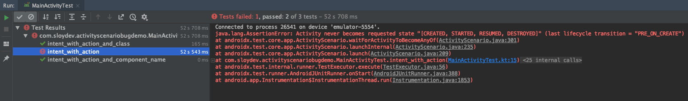

# ActivityScenario's Intent Bug
Sample project to reproduce a bug with [ActivityScenario](https://developer.android.com/reference/androidx/test/core/app/ActivityScenario) when using Intents with actions.

## Code
The relevant code is in the instrumentation test named [MainActivityTest](https://github.com/Sloy/activityscenario-intent-bug/blob/master/app/src/androidTest/java/com/sloydev/activityscenariobugdemo/MainActivityTest.kt):
```kotlin
@Test
fun intent_with_action() {
    val intent = Intent(Intent.ACTION_VIEW, Uri.parse("scenario://test"))

    ActivityScenario.launch<MainActivity>(intent)
    // Fails: java.lang.AssertionError: Activity never becomes requested state "[CREATED, STARTED, RESUMED, DESTROYED]" (last lifecycle transition = "PRE_ON_CREATE")
}
```

## Result:

